# ⚡ CodePulse

> **The Living Documentation Engine.**  
> Bridge the gap between Static Analysis and Runtime Tracing to eliminate "Zombie Code" and visualize your true architecture.

 

---

## 🛑 The Problem: Documentation Drift

In modern microservices, **Static Analysis** lies (it shows code that isn't used) and **Distributed Tracing** is overwhelming (it shows data but no context).

Developers are left with:
*   🧟 **Zombie Code:** APIs that exist in Git but haven't received traffic in months.
*   👻 **Hidden Dependencies:** Database calls or external requests that aren't documented in the README but appear at runtime.
*   📉 **Coverage Gaps:** No idea if the "Critical Path" is actually being tested.

## 💡 The CodePulse Solution

CodePulse reconciles your **Source Code (AST)** with your **OpenTelemetry Traces** to generate a "Living Dashboard" that empowers architects and developers.

```mermaid
graph TD
    A[Java Source Code] -->|Tree-Sitter| B(Static Graph);
    C[Runtime Traffic] -->|OpenTelemetry| D(Dynamic Traces);
    B --> E{Flow Reconciler};
    D --> E;
    E -->|merged data| F[Reconciled Graph];
    F -->|Analysis| G[🤖 AI Architect];
    F -->|Visualization| H[HTML Dashboard];
```



## ✨ Key Features

### 🔍 Surgical Instrumentation
Zero-config Java instrumentation. We don't just attach an agent; we **understand** your code structure.
*   Automatic `try/finally` span wrapping.
*   Injection of `span.addEvent` for DB (`.save()`) and HTTP (`.postForObject()`) calls.

### 🕵️ Zombie Detection
CodePulse highlights methods that:
*   ✅ **Verified:** Are running in production right now.
*   🕸️ **Zombie:** Exist in your codebase but have **zero** execution traces.
*   🔵 **Discovered:** Dependencies found at runtime that you didn't know existed.

### 🧠 AI Architect (Powered by OpenAI)
Integrated with GPT-4o to provide an executive summary:
*   *"OrderController is tightly coupled to InventoryService."*
*   *"30% of your codebase is dead code."*
*   *"Risk Score: 78/100"*

---

## 🚀 Quick Start (The Playground)

Experience CodePulse locally in under 5 minutes.

### Prerequisites
*   Node.js & pnpm
*   Docker & Docker Compose
*   Java JDK 17+

### 1. Setup & Build
```bash
git clone https://github.com/your-org/codepulse.git
cd codepulse
pnpm install
pnpm run build
```

- **Automated**: `run_demo.ps1` orchestrates the entire flow using Docker Compose.
- **Strict Hygiene**: Source control ignores all build artifacts and generated files.

## 🚀 Quick Start (Simulation)
1. **Prerequisites**: Docker Desktop, Java 21, Node.js 18+.
2. **Setup**:
   ```bash
   pnpm install
   pnpm run build
   ```
3. **Run Demo** (Chaos Mode v1.1.0):
   ```powershell
   ./run_demo.ps1
   ```
   This will:
   - Build all services.
   - Launch Order, Inventory, Payment, and OTel Collector via Docker.
   - Simulate a transaction.

4. **Verify**:
   ```bash
   node packages/cli/dist/index.js generate --source ./playground --traces temp/traces/trace-dump.json --output report.html --ai mock
   ```

> **Pro Tip:** To use the real AI Architect, set `export OPENAI_API_KEY=sk-...` and use `--ai openai`.

### 4. View Results
Open `report.html` in your browser to see the Mermaid diagram and AI assessment!

---

## 🤝 Contributing
-   **Core**: See `packages/core` for domain models.
-   **Extensions**: Want to add Python support or Claude AI? Read [CONTRIBUTING_EXTENSIONS.md](docs/CONTRIBUTING_EXTENSIONS.md).

## 📦 Architecture

*   **Manager:** Turborepo
*   **Core:** TypeScript + Zod
*   **Parsing:** tree-sitter-java
*   **Visualization:** Mermaid.js

## 📄 License

MIT © [CodePulse Team]
