# ⚡ CodePulse

> **The Living Documentation Engine.**  
> Bridge the gap between Static Analysis and Runtime Tracing to eliminate "Zombie Code" and visualize your true architecture.

 

---

## 🛑 The Problem: Documentation Drift

In modern microservices, **Static Analysis** lies (it shows code that might not be used) and **Distributed Tracing** is overwhelming (it shows data but no context).

Developers are left with:
*   🧟 **Zombie Code:** APIs that exist in Git but haven't received traffic in months.
*   👻 **Hidden Dependencies:** Database calls or external requests that aren't documented but appear at runtime.
*   📉 **Coverage Gaps:** No idea if the "Critical Path" is actually being exercised.

## 💡 The CodePulse Solution

CodePulse reconciles your **Source Code (AST)** with your **OpenTelemetry Traces** to generate a "Living Dashboard" that empowers architects and developers.

```mermaid
graph TD
    A[Java Source Code] -->|Tree-Sitter| B(Static Graph);
    C[Runtime Traffic] -->|OpenTelemetry| D(Dynamic Traces);
    B --> E{Flow Reconciler};
    D --> E;
    E -->|merged data| F[Reconciled Graph];
    F -->|Analysis| G[🤖 AI Architect];
    F -->|Visualization| H[HTML Dashboard];
```



## ✨ Key Features

### 🔍 Static-Dynamic Reconciliation
CodePulse uses **Tree-Sitter** to parse your Java classes and matches them against **OpenTelemetry** spans. We support matching via:
*   Exact Class/Method names.
*   Spring Boot HTTP Routes (`@GetMapping`, `@PostMapping`).
*   Service-level flattening for complex OTLP exports.

### 🕵️ Zombie Detection
CodePulse highlights methods that:
*   ✅ **Verified:** Are running in your system right now.
*   🕸️ **Zombie:** Exist in your codebase but have **zero** execution traces.
*   🔴 **Error:** Captured exceptions or failed HTTP status codes.
*   🔵 **Discovered:** Dependencies found at runtime that weren't in your static graph.

### 🧠 AI Architect (Multi-Provider)
Intelligent analysis of your system health:
*   **Google Gemini** (Recommended): Uses Gemini 1.5 Flash for high-speed architectural assessment.
*   **OpenAI**: Support for GPT-4o.
*   **Executive Summary**: Risk scores, tight coupling warnings, and dead code metrics.

---

## 🚀 Quick Start (The Demo)

Experience CodePulse locally in under 5 minutes using our **Micro-Commerce** playground.

### Prerequisites
*   Node.js 18+ & pnpm
*   Docker Desktop
*   Java JDK 21

### 1. Setup & Build
```bash
pnpm install
pnpm run build
```

### 2. Run the Demo
```powershell
./run_demo.ps1
```
This automated script will:
1. Build 6 microservices (Gateway, Auth, Order, Payment, Shipping, Product).
2. Start the infrastructure via Docker Compose (Collector + Services).
3. Wait for health checks to pass.
4. Simulate 10 batches of realistic traffic.
5. Capture and dump OTel traces to `temp/traces/trace-dump.json`.

### 3. Generate the Dashboard
```bash
# Using Mock AI (No key needed)
node packages/cli/dist/index.js generate --source ./playground --traces temp/traces/trace-dump.json --output report.html --ai mock

# Using Google Gemini (Requires GOOGLE_API_KEY)
# export GOOGLE_API_KEY=your_key
node packages/cli/dist/index.js generate --source ./playground --traces temp/traces/trace-dump.json --output report.html --ai google
```

### 4. View Results
Open `report.html` in your browser. You'll see a interactive Mermaid graph where you can:
*   Click nodes to see **executions** and **average duration**.
*   See **discovered dependencies** (DB calls, external APIs).
*   Identify the exact point of failure in failing flows.

---

## 🤝 Contributing & Architecture

Check out our [Contributing Guide](CONTRIBUTING.md) to learn how to add language plugins or AI adapters.

*   **Monorepo:** Managed with Turborepo & pnpm.
*   **Core:** Inversion of Control for Parsers and AI Providers.
*   **Plugins:** `plugin-java` for AST analysis.
*   **Adapters:** `adapter-google`, `adapter-openai`.

## 📄 License

MIT © [CodePulse Team]
