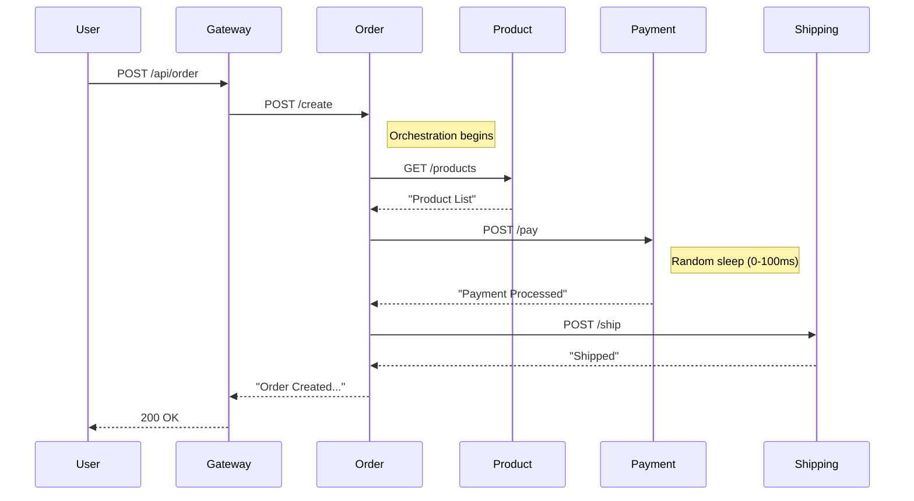

# Generated Technical Specifications

**Status:** Generated from Source Code
**Version:** 1.0.0

## 1. System Overview

The system follows a **Microservices Mesh** architecture.
*   **Entry Point:** `Gateway Service` acting as the reverse proxy.
*   **Communication:** Synchronous HTTP calls via `RestTemplate` on port `8080`.
*   **Service Discovery:** Hardcoded DNS resolution (Docker networking pattern) using service names (e.g., `http://order-service:8080`).

## 2. Functional Flows

### Flow 1: Creating an Order (Primary Path)
**Trigger:** User sends `POST /api/order` to the Gateway.

**Orchestration Logic:**
1.  The **Gateway** forwards the request to the **Order Service** (`/create`).
2.  The **Order Service** performs a scatter-gather operation:
    *   **Inventory Check:** Calls **Product Service** (`GET /products`) to retrieve item details.
    *   **Payment Processing:** Calls **Payment Service** (`POST /pay`) to capture funds.
    *   **Fulfillment:** Calls **Shipping Service** (`POST /ship`) to generate a label.
3.  **Aggregation:** The Order Service concatenates the results: `"Order Created: [Product] | [Payment] | [Shipping]"` and returns it to the Gateway.

### Flow 2: User Authentication
**Trigger:** User sends `POST /api/login` to the Gateway.
*   The Gateway proxies the call to **Auth Service** (`/login`).
*   Returns: "Login Success".

## 3. Component Deep Dive

| Service | Endpoint | Dependencies | Internal Logic / Analysis |
| :--- | :--- | :--- | :--- |
| **Gateway** | `/api/order` | Order Service | Proxy passthrough. |
| **Gateway** | `/api/login` | Auth Service | Proxy passthrough. |
| **Order** | `/create` | Product, Payment, Shipping | Orchestrates 3 downstream calls. Fails if any dependency fails. |
| **Payment** | `/pay` | None | **Simulated Instability:** Contains random sleep (0-100ms) and a ~10% chance (`random > 8`) of throwing `RuntimeException("Payment Failed")`. |
| **Product** | `/products` | None | Static response: "Product List". |
| **Shipping** | `/ship` | None | Static response: "Shipped". |
| **Auth** | `/login` | None | Static response. |
| **Auth** | `/reset-password` | None | **Zombie Endpoint:** Identified in source code but not referenced by Gateway or other services. |

## 4. Sequence Diagram

